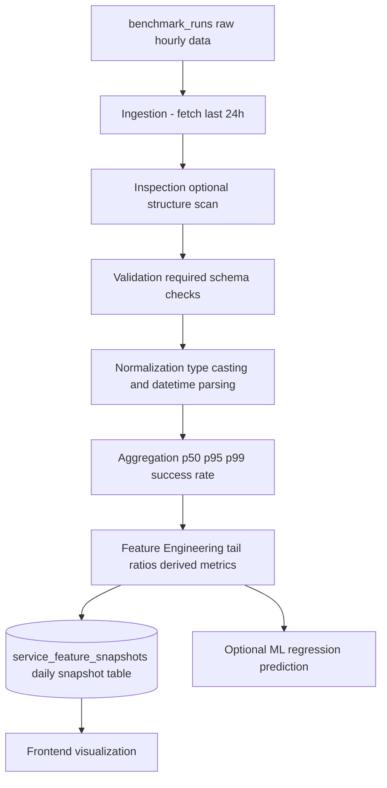

# FS Lab – ML & Data Pipeline

This repository contains the data pipeline and feature engineering logic
for the FS Lab system.

The pipeline transforms raw benchmark measurements into structured,
time-based feature snapshots that can be used for:

- trend analysis
- performance monitoring
- frontend visualization
- future ML experimentation

---

## Architecture Overview

The system follows a structured data-engineering pipeline:

1. Ingestion – fetch raw benchmark runs from Supabase
2. Validation – ensure schema correctness
3. Normalization – enforce consistent types & formats
4. Aggregation – compute service-level percentiles
5. Feature Engineering – derive tail ratios & metrics
6. Persistence – store daily service snapshots
7. (Optional) ML – regression / experimentation

---

## Pipeline Diagram

## Data Flow

- Raw backend performance data is written hourly to `benchmark_runs`.
- A daily GitHub Actions workflow triggers the pipeline.
- The pipeline aggregates the last 24 hours of data.
- Service-level features are computed.
- Results are persisted in `service_feature_snapshots`.
- The frontend consumes the snapshot table directly.

---

## Design Philosophy

The focus of this repository is:

- Reproducibility
- Deterministic feature generation
- Time-based aggregation
- Clean separation of concerns

Machine Learning is optional and built on top of a solid data foundation.
